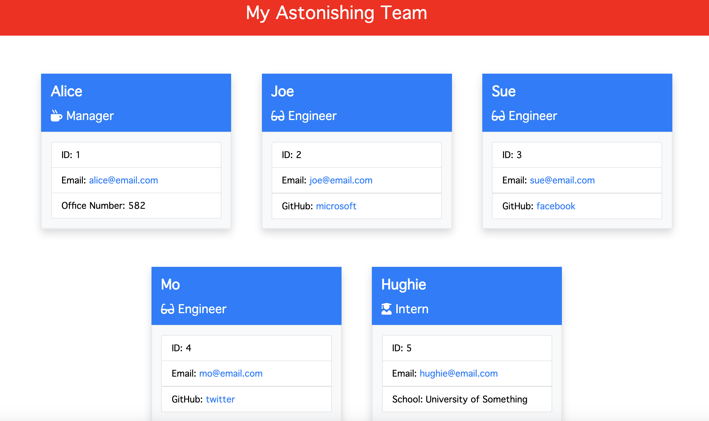

# The Astonishing Team Profile Maker
## by Aaron Rosenblatt

#### I wrote Node.js commands combined with JavaScript to make a professional employee team profile generator. When the command "node index.js" is entered into Terminal, a series of prompts appears for the user to answer. The command-line application then incorporates the responses to make a high-quality HTML using CSS so the user can have their team's basic information and quick access to their emails and GitHub profiles. The HTML will include the employee's name, their role on the team with a unique icon indicating their role, their employee ID and email address. If the employee is a manager, their office number will be included in the profile. If the employee is an engineer, their GitHub username will be included in the profile. If the employee is an intern, their school will be included in the profile. Also, when the user clicks on an email address the default email program opens and populates the "to" field of the email with the address. When the user clicks on a GitHub username that GitHub profile opens in a new tab. Through the commands the user can add any number of employees to the team. The application uses unit tests that I wrote for Test Driven Development to ensure the code is maintainable. This application uses Jest for running the unit tests and Inquirer for collecting input from the user. I created this application from scratch. The Astonishing Team Profile Maker features Node.js, Jest, Inquirer, jQuery, Bootstrap, Font Awesome, HTML and CSS. 

#### To use this README maker, clone the [README maker repository](https://github.com/noplur/astonishing-team-profile-maker), use Terminal to go to The Astonishing Team Profile Maker's root directory and enter "node index.js" and follow the prompts.  

### The GitHub repository for The Astonishing Team Profile Maker can be viewed here: https://github.com/noplur/astonishing-team-profile-maker

### The Astonishing Team Profile Maker walkthrough video can be viewed here: https://drive.google.com/file/d/1mGPrY8pldhhUktmFdzhpY84EYRzORxQV/view

### Here is a screenshot of a sample Team Profile Maker using the The Astonishing Team Profile Maker:
### 